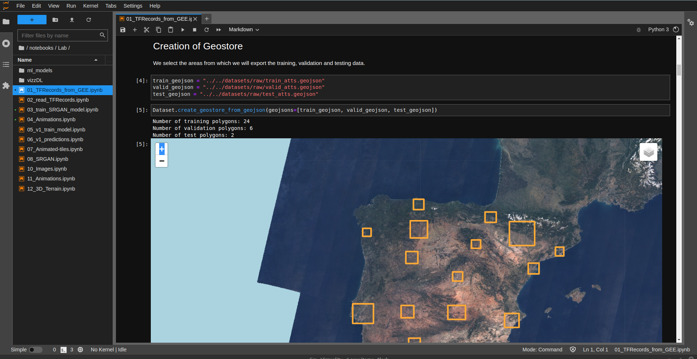
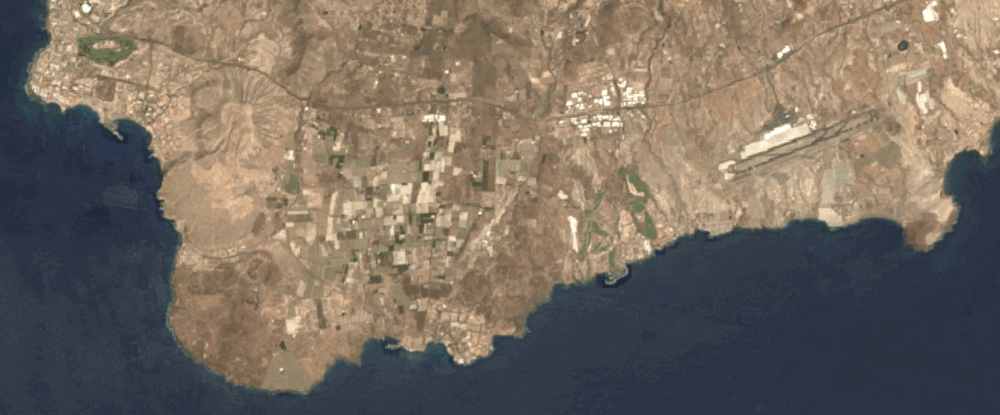
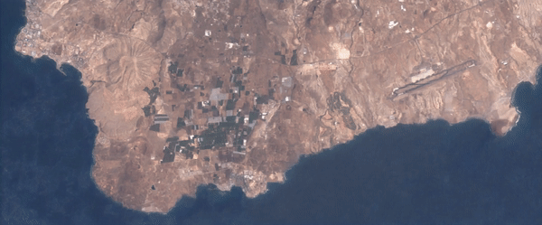

Redes
==============================

[Red.es](https://www.red.es/es) is a grant from the Ministerio De Asuntos Económicos Y Transformación Digital to carry out innovation in Vizzuality’s portfolio of Digital Content products and services.

Project Organization
------------

    ├── LICENSE                 <- The LICENSE using this project.
    ├── README.md               <- The top-level README for developers using this project.
    ├── CHANGELOG.md            <- The top-level CHANGELOG for developers using this project.
    ├── env.default  			<- Environment vars definition
    ├── Makefile           		<- Makefile with commands
    ├──.editorconfig			<- Helps maintain consistent coding styles
    ├──.pre-commit-config		<- Helps setup github basic precommit hooks
    ├── Dockerfile         		<- Docker file definition
    ├── docker-compose.yml  	<- Docker configs environment definition
    ├── .dockerignore  			<- files don't want to copy inside container
    ├── .gitignore  			<- files don't want to copy in githubs
    ├── .github  				<- github configs
    │   └── pull_request_template.md <- github pr template
    ├── requirements.txt       	<- The requirements for development
    ├── setup.cfg   			<- a config file for pytest, flake8 and yapf
    ├── setup.py   				<- config file for pip module
    ├── docs 					<- A default Sphinx project with support for module autodoc and markdown.
    │   └── __init__.py
    ├── test                	<- Test setup folder using pytest, datatest and hypothesis
    │   └── __init__.py
    ├── tox.ini            	    <- tox file with settings for running tox;
    |
    ├── data
    │   ├── processed           <- The final, canonical data sets for modeling.
    │   └── raw                 <- The original, immutable data dump.
    |
    |
    │   ├── notebooks           <- Naming convention is a number (for ordering),
    │   │                       the creator's initials, and a short `-` delimited e.g.
    │   │                       `1.0-jqp-initial-data-exploration`.
    │   │
    │   ├──.env
    │   ├──.dockerignore
    │   ├──requirements.txt           <- Notebooks requirements
    │   ├──Dockerfile                 <- Sets up Jupyter notebooks environment
    │   ├──jupyter_notebook_config.py <- Configure Jupyter notebooks
    │   ├── template_notebooks        <- where the notebooks template will live.
    │   │
    │   ├── Lab                 <- Testing and development
    │   │
    │   └── Final               <- The final cleaned notebooks for reports/ designers /
    |				               developers etc.
    │

--------

## Steps for use:

### Install:
------------
#### First, setup one of your environments

- Create a `.env` file in the root directory following the `.env.example` template. Add the following variables:

    - EE_PRIVATE_KEY: *Google Cloud Platform service account key.*
    - GCSBUCKET: *Bucket name.*
    - PROJECT_ID: *Google Project ID.*

    The service account has to be [registered to use Earth Engine](https://developers.google.com/earth-engine/guides/service_account#register-the-service-account-to-use-earth-engine).

- With [docker]() and [docker-compose]() in your system, you can develop inside containers:
``` bash
make up
```

<p><small>Project based on the <a target="_blank" href="https://drivendata.github.io/cookiecutter-data-science/">cookiecutter data science project template</a>. #cookiecutterdatascience</small></p>

--------
Enhancing satellite imagery with super-resolution neural networks.
------------

### Introduction

High spatial and temporal resolution earth observation images are desirable for many remote sensing applications to provide a finer depiction of spatial features and dynamics. Landsat provides the longest record of moderate spatial resolution (30 m) data of the earth from 1984 to the present. It is currently a fundamental data source for understanding historical change and its relation to carbon dynamics, hydrology, climate, air quality, biodiversity, and wildlife demography, among others. Landsat temporal coverage is sparse due to the 16-day repeat visit and cloud contamination. Temporal enhancement is a key requirement, but spatial enhancement is another aspect of Landsat that could be improved for time series applications.  Enhancement of spatial resolution has been carried out mostly by pan-sharpening of satellite imagery ([Rahaman et al. 2017](#R1)). Pan-sharpening is the process of fusing higher spatial resolution bands with their lower spatial resolution counterparts to create higher spatial resolution images. For recent sensors such as Landsat-8 and Sentinel-2, this requirement is met with the panchromatic band. However, for a consistent Landsat time series, a method that will provide the same level of enhancement across sensors (bands) is needed.

Recently, deep learning convolutional neural networks (CNNs) have shown to perform well in enhancing satellite imagery coming from both solar ([Díaz Baso & Asensio Ramos 2018](#R2)) and earth observations ([Collins et al. 2017](#R3); [Pouliot et al. 2018](#R4); [Molini et al. 2019](#R5); [Lu et al. 2019](#R6); [Wang et al. 2020](#R7)). CNNs are a special form of an artificial neural network. A neural network is made up of a collection of basic fundamental structures, called neurons. Each neuron is only able to carry out a very basic operation on the input vector: it multiplies all the input values by some weights, adds some bias, and finally returns the value of a certain user-defined nonlinear activation function. The output is then input into another neuron that carries out a similar task. Neural networks are optimized iteratively by updating the weights and biases so that the difference between the predicted and the true output values is minimized. This optimization is widely known as the learning or training process. In this process, a training dataset is required with both input and output values.

The most basic type of neural network is the fully connected network (FCN), in which every input is connected to every neuron of the following layer. While an FCN works nicely with small input vectors, they quickly become computationally expensive as the complexity of the network (number of neurons) increases. This is the case when you try to use FCNs with images as input. Fortunately, this issue was solved with the appearance of CNNs. The most important ingredient in a CNN is the convolutional layer which is composed of several convolutional neurons (or filters) with m x n weights each. Each CNN neuron carries out the convolution of the input with a certain (typically small) kernel. Similar to an FCN, the output of convolutional neurons is often passed through a nonlinear activation function. Essentially, a convolution neural network can learn the optimal set of filters (kernels) to apply to an image for a specific computer vision task. The fundamental advantage of CNNs is that the same weights are shared across the whole input, drastically reducing the number of unknowns.

Some particular types of CNNs can be used for super-resolution enhancement. Super-resolution is the process of upscaling and or improving the details within an image. Often a low-resolution image is taken as an input and the same image is upscaled to a higher resolution, which is the output. The details in the high resolution output are filled in where the details are essentially unknown. Super-resolution CNNs have been widely used for this purpose with a variety of different types of images, and only recently, with the availability of simultaneous observations, they are beginning to be consistently used with remote sensing imagery ([Collins et al. 2017](#R3); [Pouliot et al. 2018](#R4); [Molini et al. 2019](#R5); [Lu et al. 2019](#R6); [Wang et al. 2020](#R7)).

### Our approach

We have taken advantage of the simultaneous availability of Landsat and Sentinel-2 data. Sentinel-2 has a much smaller time coverage (from 2015 to present), but a larger spatial resolution of 10 m, which makes it an ideal option for generating an extensive, spatially-enhanced, historical Landsat dataset. A consistent image pair suitable for training a super-resolution CNN will require simultaneous, cloud free, Landsat and Sentinel-2 images. The easiest way to achieve that will be by generating annual composites. An example of such composites for Landsat and Sentinel-2 are shown in Figure 1A top and bottom, respectively.  A close-up view of a smaller region is also displayed in Figure 1B. From there, it is evident that with the larger spatial resolution of Sentinel-2 we can better resolve small features like urban areas, croplands, or greenhouses. Notice, for example, that croplands are hardly distinguishable from forest and grassland areas with Landsat, while the same is not true with the higher resolution of Sentinel-2 (see Figure 1B).


*Fig 1. (A) Area of Interest in Tenerife observed with Landsat 8 (top) and Sentinel 2 (bottom). Close-up of the white rectangle in panel B.*

#### Application
- **Animations**
In Figure 2 we display a time-lapse video of a growing city in Angola from 1988 to 2019 observed with Landsat (top) and a single snapshot (in the year 2019) of the same area observed with Sentinel-2 (bottom).


*Fig 2. (Top) Time-lapse video of a growing city in Angola from 1988 to 2019 observed with Landsat. (Bottom) The corresponding area in 2019 was observed with Sentinel 2.*

To do this, we have developed the following activities:

**A1.1** - A software package to create training, validation and test datasets in TFRecord format:
- [Code](https://github.com/Vizzuality/redes-data/blob/main/notebooks/Lab/vizzDL/datasets.py)
- [Notebook](https://github.com/Vizzuality/redes-data/blob/main/notebooks/Lab/01_TFRecords_from_GEE.ipynb) 



The TFRecords can be created from the [notebook](/notebooks/Lab/01_TFRecords_from_GEE.ipynb) or the command line.
For the latter, first enter into the docker terminal by typing
```
docker exec -it redes_jupyter_notebook bash
``` 
and then move to the following directory
```
cd tf/notebooks/Lab
```
Pre-defined geometries from where the images will be extracted are provided in the GitHub release as GeoJSON files. They can be found in the `'../../datasets/raw/` directory. We provide the script `datasets.py`.
```
python vizzDL/datasets.py --dataset_name "L8_S2_SR_x3_test" --geojsons "../../datasets/raw/train_atts_test.geojson" "../../datasets/raw/valid_atts_test.geojson" "../../datasets/raw/test_atts_test.geojson"
```

All the parameters are described here:
```
--folder_path = '../../datasets/processed/Models/'
    Path to the folder where dataset parameters will be stored.
--dataset_name = 'L8_S2_SR_x3_test'
    Name of the folder where dataset parameters will be stored.
--slugs = 'Landsat-8-Surface-Reflectance' 'Sentinel-2-Top-of-Atmosphere-Reflectance'
    A list of dataset slugs.
--init_date = '2019-01-01'
    Initial date of the composite.
--end_date = '2019-12-31'
    Last date of the composite.'
--geojsons = "../../datasets/raw/train_atts_test.geojson" "../../datasets/raw/valid_atts_test.geojson" "../../datasets/raw/test_atts_test.geojson"]ç
    GeoJSON file paths with the regions.
--input_bands = 'RGB'
    List of input bands.
--output_bands = 'RGB'
    List of output bands.
--input_rgb_bands = 'L8_R' 'L8_G' 'L8_B'
    List of new input RGB band names.
--output_rgb_bands = 'S2_R', 'S2_G', 'S2_B'
    List of new output RGB band names.  
--scale = 10
    Scale of the images.
--sample_size = 2000
    Number of samples to extract from each polygon.
--kernel_size = 192
    An integer specifying the height and width of the 2D images.
```

**A1.2** - Training of super-resolution convolutional neural networks.
- [Code](https://github.com/Vizzuality/redes-data/tree/main/notebooks/Lab/vizzDL/train.py)
- [Notebook](https://github.com/Vizzuality/redes-data/blob/main/notebooks/Lab/03_train_SRGAN_model.ipynb)


*Fig 3. Example of a trained model applied to Landsat images.*

The model can be trained from the [notebook](/notebooks/Lab/03_train_SRGAN_model.ipynb) or the command line.

Pre-trained models are provided in the GitHub release. They can be found in the `'../../datasets/processed/Models/` directory. If you want to train the model with your own data, we provide the script train.py to this aim. We also provide the original parameters used in the training of the networks.
```
python vizzDL/train.py
```

All the parameters are described here:
```
--folder_path = '../../datasets/processed/Models/'
    Path to the folder where dataset parameters will be stored.
--dataset_name = 'L8_S2_SR_x3_test'
    Name of the folder where dataset parameters will be stored.
--model_name = 'srgan_generator_L8_to_S2_x3_test'
    Name of the model.
--model = 'srgan_generator'
    Keras model.
--scaling_factor = 3
    Scaling Factor for Super-Resolution.
--normalize_rgb = True
Boolean to normalize RGB bands.
--norm_range = [0,1] [-1,1]
    List with two values showing the normalization range.
--batch_size = 32
    A number of samples processed before the model is updated.
--shuffle_size = 2000
    Number of samples to be shuffled.
--epochs = 25
    Number of complete passes through the training dataset.
```

**A1.3** - Creation of animated-tiles.
- [Code](https://github.com/Vizzuality/redes-data/tree/main/notebooks/Lab/vizzDL/animations.py)
- [Notebook](https://github.com/Vizzuality/redes-data/blob/main/notebooks/Lab/04_Animations.ipynb)


*Fig 4. Example of animation.*

A pre-defined geometry from where the animated-tiles will be created is provided in the GitHub release as a GeoJSON file. It can be found in the `'../../datasets/raw/` directory. We provide the script `animations.py`.
```
python vizzDL/animations.py --geometry "../../datasets/raw/Menongue.geojson" --start_year 2019 --stop_year 2021
```

All the parameters are described here:
```
--instrument = 'Landsat'
    Name of a instrument (Landsat or Sentinel).
--geometry = "../../datasets/raw/Menongue.geojson"
    GeoJSON file with a polygon,
--start_year = 1988
    First year.
--stop_year = 2021
    Last year.
--model = 'srgan_generator'
    Keras model.
--norm_range = [[0,1],[-1,1]]
    List with two values showing the normalization range.
--folder_path = '../../datasets/processed/Tiles/'
    Path to the folder to save the tiles.
--region_name = 'Menongue'
    Name of the folder to save the tiles.
--min_z = 10 
    Min zoom level.
--max_z = 14
    Min zoom level.
```

###  References
1. <a id="R1" />[Rahaman, K. R., Hassan, Q. K., & Ahmed, M. R. (2017)](https://www.mdpi.com/2220-9964/6/6/168). Pan-sharpening of Landsat-8 images and its application in calculating vegetation greenness and canopy water contents. ISPRS International Journal of Geo-Information, 6(6), 168.

2. <a id="R2" />[Baso, C. D., & Ramos, A. A. (2018)](https://www.aanda.org/articles/aa/abs/2018/06/aa31344-17/aa31344-17.html). Enhancing SDO/HMI images using deep learning. Astronomy & Astrophysics, 614, A5.

3. <a id="R3" />[Collins, C. B., Beck, J. M., Bridges, S. M., Rushing, J. A., & Graves, S. J. (2017, November)](https://dl.acm.org/doi/abs/10.1145/3149808.3149815). Deep learning for multisensor image resolution enhancement. In Proceedings of the 1st Workshop on Artificial Intelligence and Deep Learning for Geographic Knowledge Discovery (pp. 37-44).

4. <a id="R4" />[Pouliot, D., Latifovic, R., Pasher, J., & Duffe, J. (2018)](https://www.mdpi.com/2072-4292/10/3/394). Landsat super-resolution enhancement using convolution neural networks and sentinel-2 for training. Remote Sensing, 10(3), 394.

5. <a id="R5" />[Molini, A. B., Valsesia, D., Fracastoro, G., & Magli, E. (2019)](https://ieeexplore.ieee.org/abstract/document/8946717/). DeepSUM: Deep neural network for Super-resolution of Unregistered Multitemporal images. IEEE Transactions on Geoscience and Remote Sensing, 58(5), 3644-3656.

6. <a id="R6" />[Lu, T., Wang, J., Zhang, Y., Wang, Z., & Jiang, J. (2019)](https://www.mdpi.com/2072-4292/11/13/1588). Satellite image super-resolution via multi-scale residual deep neural network. Remote Sensing, 11(13), 1588.

7. <a id="R7" />[Wang, Z., Jiang, K., Yi, P., Han, Z., & He, Z. (2020)](https://www.sciencedirect.com/science/article/pii/S0925231219314602). Ultra-dense GAN for satellite imagery super-resolution. Neurocomputing, 398, 328-337.

